# Jarkom-Modul-5-IT29-2024

## Anggota Kelompok
| Nama | NRP |
|---------|---------|
| Harwinda | 5027231079   |
| Muhammad Syahmi Ash Shidqi | 5027231085 |

## Topologi
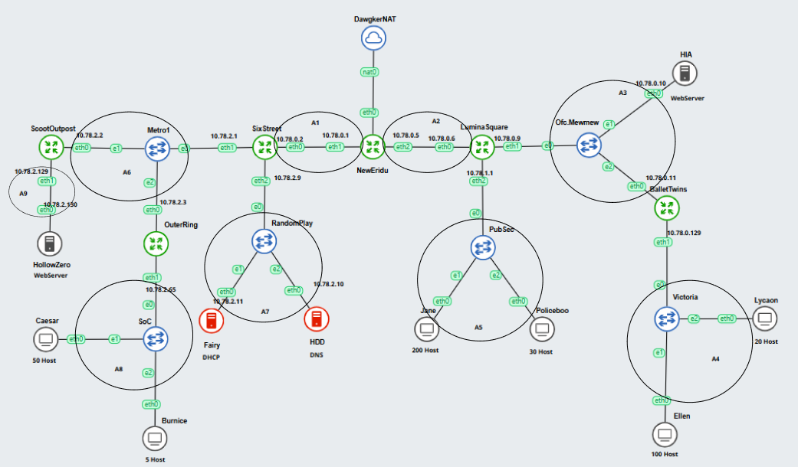

## Subnetting


## Link Pembagian IP - VLSM
https://docs.google.com/spreadsheets/d/1vULZWzsCS2hpv7os7331vM3Zk-mAp_iKmx8N_rPTOfg/edit?usp=sharing

## Konfigurasi Network
### NewEridu
```
auto eth0
iface eth0 inet dhcp

#A1
auto eth1
iface eth1 inet static
  address 10.78.0.1
  netmask 255.255.255.252
  
#A2
auto eth2
iface eth2 inet static
  address 10.78.0.5
  netmask 255.255.255.252
```

### ScootOutpost
```
#A6
auto eth0
iface eth0 inet static
  address 10.78.2.2
  netmask 255.255.255.248
  gateway 10.78.2.1

#A9
auto eth1
iface eth1 inet static
  address 10.78.2.129
  netmask 255.255.255.252
```

### SixStreet
```
#A1
auto eth0
iface eth0 inet static
  address 10.78.0.2
  netmask 255.255.255.252
  gateway 10.78.0.1

#A6
auto eth1
iface eth1 inet static
  address 10.78.2.1
  netmask 255.255.255.248

#A7
auto eth2
iface eth2 inet static
  address 10.78.2.9
  netmask 255.255.255.248
```

### OuterRing
```
#A6
auto eth0
iface eth0 inet static
  address 10.78.2.3
  netmask 255.255.255.248
  gateway 10.78.2.1

#A8
auto eth1
iface eth1 inet static
  address 10.78.2.65
  netmask 255.255.255.192
```

### HDD (DNS)
```
#A7
auto eth0
iface eth0 inet static
  address 10.78.2.10
  netmask 255.255.255.248
  gateway 10.78.2.9
```

### HollowZero
```
#A9
auto eth0
iface eth0 inet static
  address 10.78.2.130
  netmask 255.255.255.252
  gateway 10.78.2.129
```

### Caesar (Client)
```
auto eth0
iface eth0 inet dhcp
```

### Burnice (Client)
```
auto eth0
iface eth0 inet dhcp
```

### Fairy (DHCP)
```
#A7
auto eth0
iface eth0 inet static
  address 10.78.2.11
  netmask 255.255.255.248
  gateway 10.78.2.9
```

### LuminaSquare
```
#A2
auto eth0
iface eth0 inet static
  address 10.78.0.6
  netmask 255.255.255.252
  gateway 10.78.0.5

#A3
auto eth1
iface eth1 inet static
  address 10.78.0.9
  netmask 255.255.255.248

#A5
auto eth2
iface eth2 inet static
  address 10.78.1.1
  netmask 255.255.255.0
```

### BalletTwins
```
#A3
auto eth0
iface eth0 inet static
  address 10.78.0.11
  netmask 255.255.255.248
  gateway 10.78.0.9

#A4
auto eth1
iface eth1 inet static
  address 10.78.0.129
  netmask 255.255.255.128
```

### HIA
```
#A3
auto eth0
iface eth0 inet static
  address 10.78.0.10
  netmask 255.255.255.248
  gateway 10.78.0.9
```

### Lycaon(Client)
```
auto eth0
iface eth0 inet dhcp
```

### Ellen(Client)
```
auto eth0
iface eth0 inet dhcp
```

### Policeboo (Client)
```
auto eth0
iface eth0 inet dhcp
```

### Jane (Client)
```
auto eth0
iface eth0 inet dhcp
```


## Routing
### NewEridu
```
#KIRI
post-up route add -net 10.78.2.8 netmask 255.255.255.248 gw 10.78.0.2 #A7
post-up route add -net 10.78.2.0 netmask 255.255.255.248 gw 10.78.0.2 #A6
post-up route add -net 10.78.2.128 netmask 255.255.255.252 gw 10.78.0.2 #A9
post-up route add -net 10.78.2.64 netmask 255.255.255.192 gw 10.78.0.2 #A8

#KANAN
post-up route add -net 10.78.0.8 netmask 255.255.255.248 gw 10.78.0.6 #A3
post-up route add -net 10.78.1.0 netmask 255.255.255.0 gw 10.78.0.6 #A5
post-up route add -net 10.78.0.128 netmask 255.255.255.128 gw 10.78.0.6 #A4
```

### ScootOutpost
```
post-up route add -net 10.78.0.0 netmask 255.255.255.252 gw 10.78.2.1 #A1
```

### SixStreet
```
up echo nameserver 192.168.122.1 > /etc/resolv.conf

post-up route add -net 10.78.2.128 netmask 255.255.255.252 gw 10.78.2.2 #A9

post-up route add -net 10.78.2.64 netmask 255.255.255.192 gw 10.78.2.3 #A8
```

### OuterRing
```
up echo nameserver 192.168.122.1 > /etc/resolv.conf
```

### HDD (DNS)
```
up echo nameserver 192.168.122.1 > /etc/resolv.conf
```

### HollowZero
```
post-up route add -net 10.78.0.0 netmask 255.255.255.252 gw 10.78.2.129 #A1

up echo nameserver 192.168.122.1 > /etc/resolv.conf
```

### Fairy (DHCP)
```
up echo nameserver 192.168.122.1 > /etc/resolv.conf

post-up route add -net 10.78.2.64 netmask 255.255.255.192 gw 10.78.2.9 #A8
post-up route add -net 10.78.1.0 netmask 255.255.255.0 gw 10.78.2.9 #A5
post-up route add -net 10.78.0.128 netmask 255.255.255.128 gw 10.78.2.9 #A4
```

### LuminaSquare
```
up echo nameserver 192.168.122.1 > /etc/resolv.conf

post-up route add -net 10.78.0.128 netmask 255.255.255.128 gw 10.78.0.11 #A4
```

### BalletTwins
```
post-up route add -net 10.78.2.8 netmask 255.255.255.248 gw 10.78.0.9 #A7

up echo nameserver 192.168.122.1 > /etc/resolv.conf
```

### HIA
```
post-up route add -net 10.78.0.4 netmask 255.255.255.252 gw 10.78.0.9 #A2

up echo nameserver 192.168.122.1 > /etc/resolv.conf
```

## Misi 2 No 2
> perangkat lain tidak bisa mengakses fairy, sedangkan fairy bisa mengakses semua perangkat.

lakukan command di Fairy
```
iptables -A INPUT -p icmp --icmp-type echo-request -j DROP
```

## Testing
Fairy ke HIC (bisa ping)
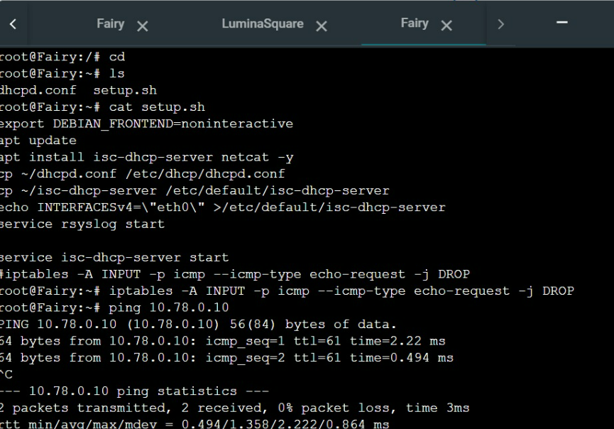

HIC ke Fairy (Tidak bisa ping)


## Misi 2 No 3
> Hanya Fairy yang dapat mengakses HDD, dan gunakan nc (netcat) untuk memastikan akses

Jalankan semuanya (dhcpnya), kemudian di HDD command
```
iptables -L INPUT -n --line-numbers
```
*untuk melihat mengecek dan memetakan aturan firewall yang mengatur siapa yang boleh masuk ke sistem*

kemudian, blok semua akses perangkat lain dengan command
```
iptables -P INPUT DROP
```

untuk memberikan izin Fairy mengakses HDD (DNS) lakukan command
```
iptables -A INPUT -s 10.78.2.11 -j ACCEPT
```
untuk Drop semua akses lakukan command
```
iptables -D INPUT 1
```

dari Fairy ke HDD (bisa ping)
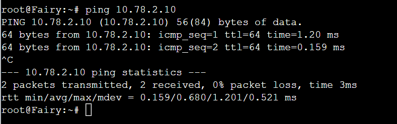

dari Lumina ke HDD (tidak bisa ping)
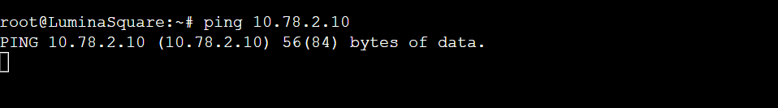

untuk testing dengan netcat, pastikan membuka port yang akan digunakan di HDD
*jangan lupa untuk restart HDD dan install netcat dulu `apt-get update` dan `apt-get install netcat`* kemudian lakukan blok kayak diatas dan testing netcat dengan command di HDD:
```
nc -l -p 3030
```
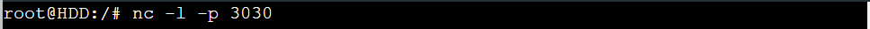

testing pada fairy dengan command
```
echo "pesan" |nc 10.78.2.10 3030
```
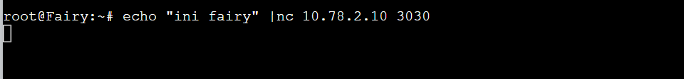

lalu balik lagi ke  HDD <br>
**Berhasil*
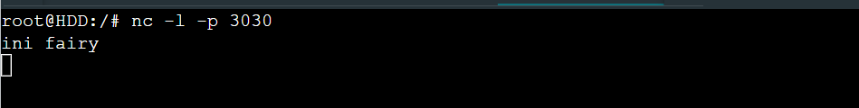

testing Pada LuminaSquare dengan cara buka port pada HDD disini saya menggunakan port 3030
```
nc -l -p 3030
```
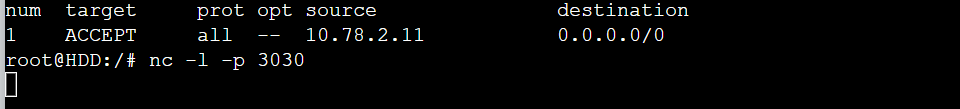

kemudian pada Lumina command:
```
echo "pesan" |nc 10.78.2.10 3030
```
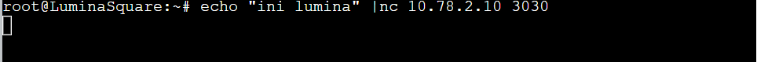


lalu balik lagi ke HDD <br>
**tidak terkirim apa - apa*

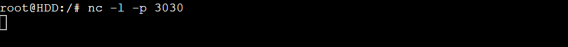

## Misi 2 No 4
> Hollow hanya boleh diakses pada hari Senin hingga Jumat dan hanya oleh faksi SoC (Burnice & Caesar) dan PubSec(Jane & Policeboo). karena hari ini hari sabtu, mereka harus menunggu hingga hari senin. Gunakan curl untuk memastikan akses ini.

Masuk ke Web console HollowZero dan run setup.sh
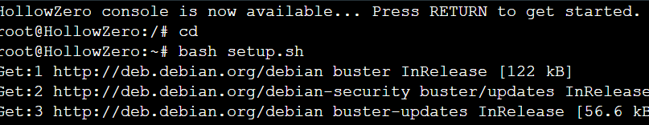

cek untuk mencoba webservernya
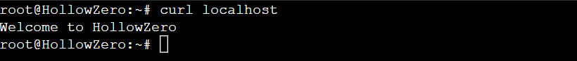

command untuk drop semua akses
```
iptables -P INPUT DROP
```

command untuk mengizinkan A8 dan A5 mengakses Hollow
```
iptables -A INPUT -s 10.78.2.64/26 -m time --weekdays Mon,Tue,Wed,Thu,Fri -j ACCEPT
iptables -A INPUT -s 10.78.1.0/24 -m time --weekdays Mon,Tue,Wed,Thu,Fri -j ACCEPT
```

Testing jika **SoC (Burnice & Caisar)** di Accept pada Mon,Tue,Wed,Thu,Fri sedangkan `date` sekarang adalah sun dengan command
```
iptables -A INPUT -s 10.78.2.64/26 -m time --weekdays Mon,Tue,Wed,Thu,Fri -j ACCEPT
```

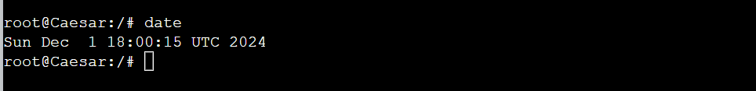 

**tidak accept hari ini (sun)*
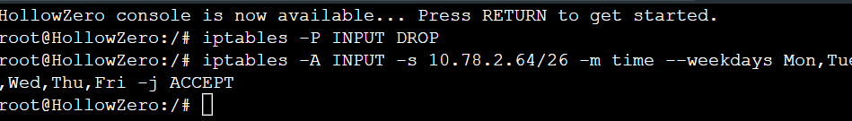

maka, SoC (Burnice & Caesar) tidak dapat mengakses
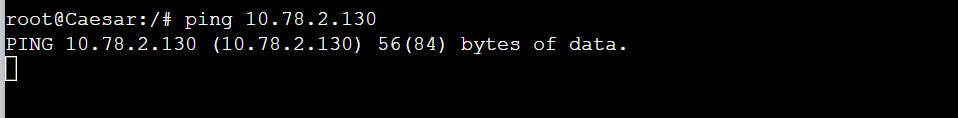
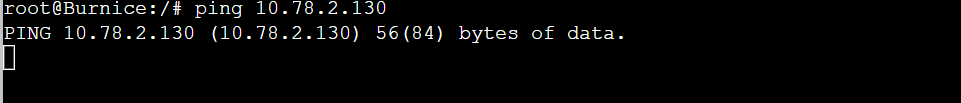


Testing Jika **SoC (Burnice & Caisar)** di Accept pada Mon,Tue,Wed,Thu,Fri,Sun (Hari ini) dengan command
```
iptables -A INPUT -s 10.78.2.64/26 -m time --weekdays Mon,Tue,Wed,Thu,Fri,Sun -j ACCEPT
```
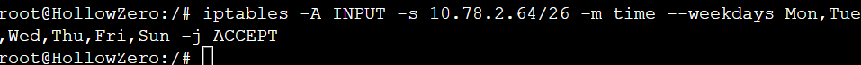

maka, SoC (Burnice & Caesar) dapat mengakses
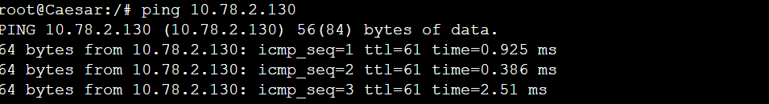
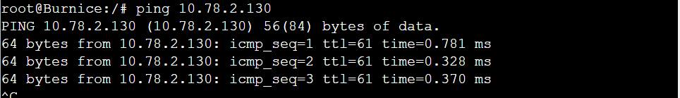

Sedangkan, PubSec (Jane & Policeboo) tidak dapat mengakses
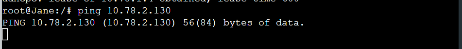
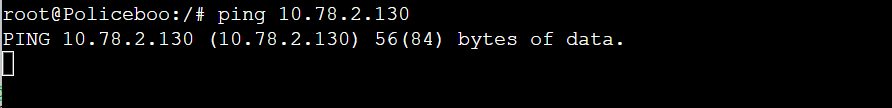

Testing jika **PubSec (Jane & Policeboo)** di Accept pada Mon,Tue,Wed,Thu,Fri sedangkan `date` sekarang adalah sun dengan command
```
iptables -P INPUT DROP
```
```
iptables -A INPUT -s 10.78.1.0/24 -m time --weekdays Mon,Tue,Wed,Thu,Fri -j ACCEPT
```
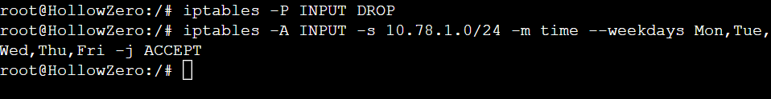

maka, PubSec (Jane & Policeboo) tidak dapat mengakses

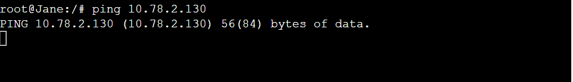
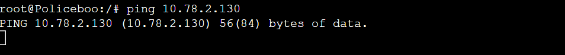

Testing Jika **PubSec (Jane & Policeboo)** di Accept pada Mon,Tue,Wed,Thu,Fri,Sun (Hari ini) dengan command
```
iptables -A INPUT -s 10.78.1.0/24 -m time --weekdays Mon,Tue,Wed,Thu,Fri,Sun -j ACCEPT
```
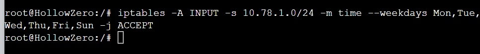

maka, PubSec (Jane & Policeboo) dapat mengakses
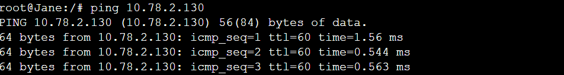
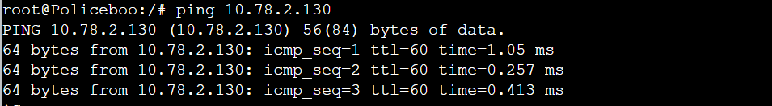

Sedangkan, SoC (Burnice & Caisar) tidak dapat mengakses
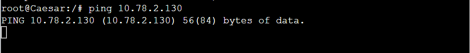
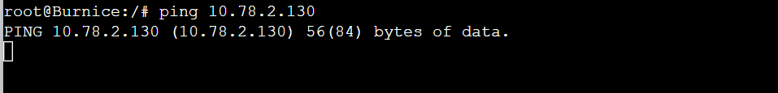

Testing Jika **PubSec (Jane & Policeboo)** dan **SoC (Burnice & Caisar)** di Accept pada Mon,Tue,Wed,Thu,Fri (Sedangkan hari ini Sun) dengan command
```
iptables -P INPUT DROP
```
```
iptables -A INPUT -s 10.78.2.64/26 -m time --weekdays Mon,Tue,Wed,Thu,Fri -j ACCEPT
iptables -A INPUT -s 10.78.1.0/24 -m time --weekdays Mon,Tue,Wed,Thu,Fri -j ACCEPT
```
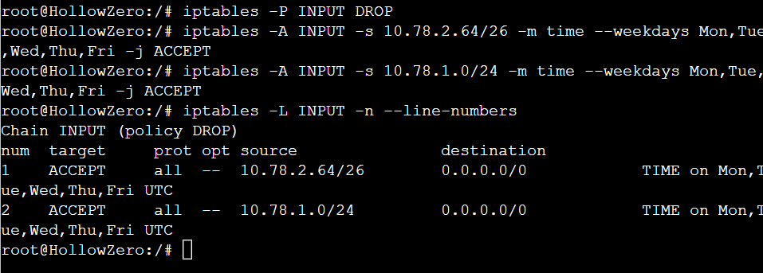

maka, PubSec (Jane & Policeboo) dan SoC (Burnice & Caisar) tidak dapat mengakses
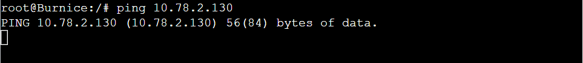
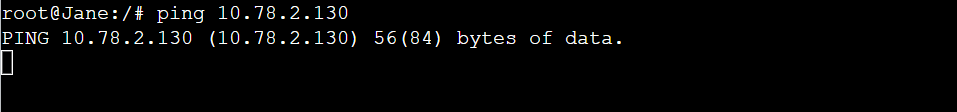

Testing Jika **PubSec (Jane & Policeboo)** dan **SoC (Burnice & Caisar)** di Accept pada Mon,Tue,Wed,Thu,Fri,Sun (hari ini Sun) dengan command
```
iptables -A INPUT -s 10.78.2.64/26 -m time --weekdays Mon,Tue,Wed,Thu,Fri,Sun -j ACCEPT
iptables -A INPUT -s 10.78.1.0/24 -m time --weekdays Mon,Tue,Wed,Thu,Fri,Sun -j ACCEPT
```

maka, PubSec (Jane & Policeboo) dan SoC (Burnice & Caisar) dapat mengakses
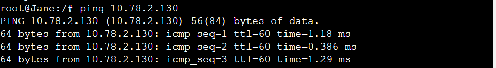
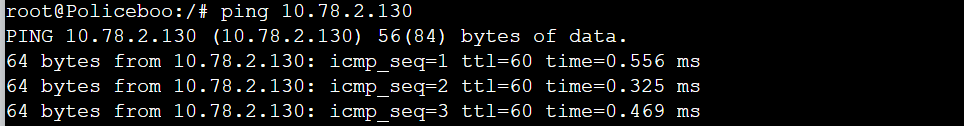
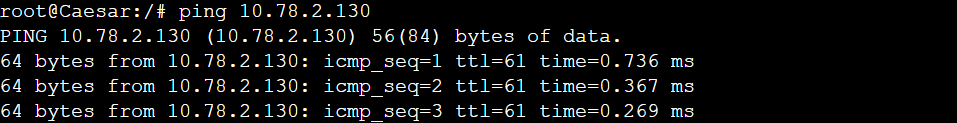
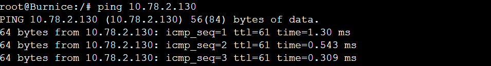

## Misi 2 No 5
> HIA hanya dierbolehkan untuk 
a. Ellen dan Lycaon pada jam 08.00-21.00
b. Jane dan Policeboo pada jam 03.00-23.00.
Gunakan Curl untuk memastikan akses ini

Masuk ke Web console HIA dan run setup.sh
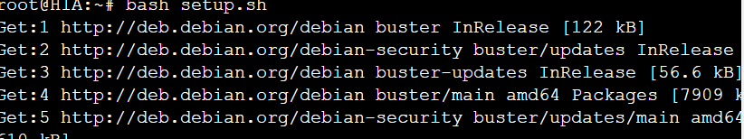

cek untuk mencoba webservernya
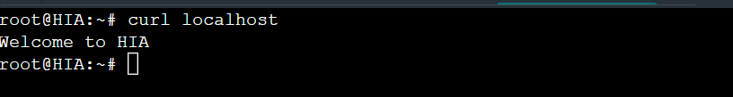

jalankan iptables 
```
iptables -P INPUT DROP
```
```
iptables -A INPUT -s 10.78.0.128/25 -m time --timestart 08:00 --timestop 21:00 -j ACCEPT 
iptables -A INPUT -s 10.78.1.0/24 -m time --timestart 03:00 --timestop 23:00 -j ACCEPT
```

Waktu sekarang (saat saya testing)
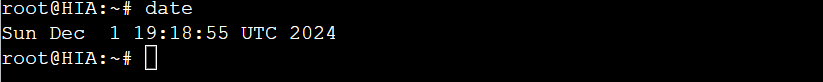

Testing Jika **Lycaon dan Ellen** di Accept pada 08:00 --timestop 21:00 (jam saat ini, 19.00-an) dengan command
```
iptables -P INPUT DROP
```
```
iptables -A INPUT -s 10.78.0.128/25 -m time --timestart 08:00 --timestop 21:00 -j ACCEPT 
```

maka, Lycaon dan Ellen bisa mengakses, dikarenakan masih dalam range jamnya
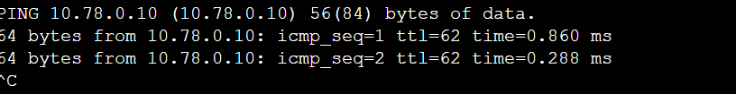
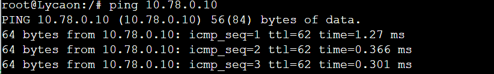

sedangkan, Jane dan Policeboo tidak dapat mengakses karena akses masih untuk Lycaon dan Ellen
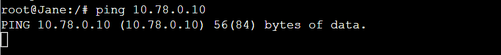
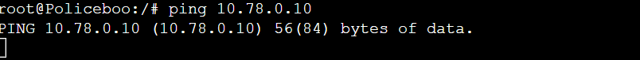


Testing Jika **Jane & Policeboo** di Accept pada 08:00 --timestop 21:00 (jam saat ini, 19.00-an) dengan command
```
iptables -A INPUT -s 10.78.1.0/24 -m time --timestart 03:00 --timestop 23:00 -j ACCEPT
```
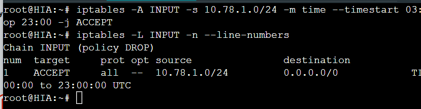

jangan lupa untuk drop iptables Lycaon dan Ellen terlebih dahulu untuk memastikan testing akses hanya untuk Jane & Policeboo
```
iptables -D INPUT 1
```

maka, Jane & Policeboo bisa mengakses, dikarenakan masih dalam range jamnya
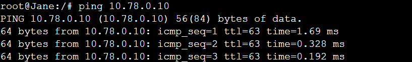
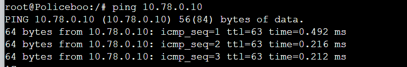

sedangkan, Lycaon dan Ellen tidak dapat mengakses karena akses masih untuk Jane & Policeboo
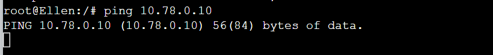
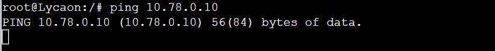

Testing Jika **Jane & Policeboo** dengan syarat di soal Accept pada 03:00 --timestop 23:00 dan  **Lycaon dan Ellen** dengan syarat di soal Accept pada 08:00 --timestop 21:00 (jam saat ini, 19.00-an)
```
iptables -A INPUT -s 10.78.0.128/25 -m time --timestart 08:00 --timestop 21:00 -j ACCEPT 
iptables -A INPUT -s 10.78.1.0/24 -m time --timestart 03:00 --timestop 23:00 -j ACCEPT
```
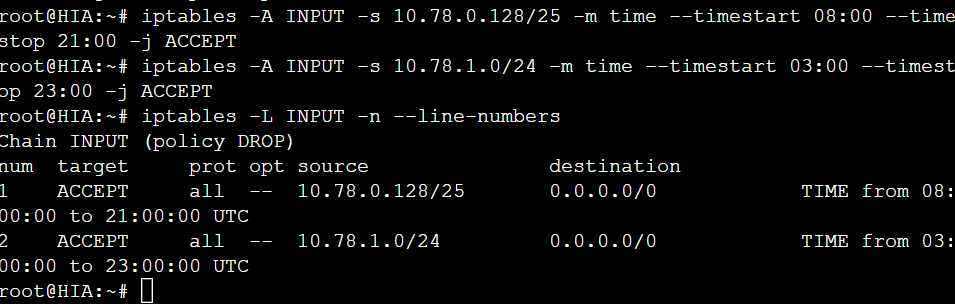


maka, Jane & Policeboo, Lycaon dan Ellen bisa mengakses, dikarenakan masih dalam jam sekarang masih dalam range jam mereka

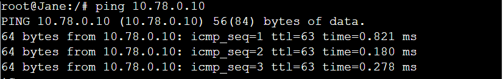


## Misi 2 No 6
> PubSec (Jane & Policeboo) diminta meperketat keamanan jaringan server HIA. Pubsec melakukan simulasi port scan menggunakan nmap pada rentang port 1-100
a. Web server harus memblokir aktivitas scan port yang melebihi 25 port secara otomatis dalam rentang waktu 10 detik
b. penyerang yang terblokir tidak dapat melakukan ping, nc, atau curl ke HIA
c. Catat Log dari Iptables untuk keperluan analisis dan dokumentasikan dalam format PDF

aktifkan HIA dengan `bash setup.sh`
kemudian run IPTABLES
**cat pada setup.sh di HIA* atau salin dibawah ini
```
#Create a chain for handling port scanning
iptables -N PORTSCAN

#Detect and handle new connections to ports 1-100
iptables -I INPUT 1 -j LOG --log-prefix "PORT SCAN BRO: " --log-level 4 --log-tcp-options --log-ip-options

iptables -A INPUT -p tcp --dport 1:100 -m state --state NEW -m recent --set --name portscan

iptables -A INPUT -p tcp --dport 1:100 -m state --state NEW -m recent --update --seconds 10 --hitcount 25 --name portscan -j PORTSCAN

#Log and block port-scanning IPs
iptables -A PORTSCAN -m recent --set --name blacklist
iptables -I PORTSCAN 1 -j LOG --log-prefix "PORT SCAN DETECTED: " --log-level 4 --log-tcp-options --log-ip-options
#iptables -A PORTSCAN -j DROP

#Block all further traffic from blacklisted IPs
#iptables -A INPUT -m recent --name blacklist --rcheck -j DROP
#iptables -A OUTPUT -m recent --name blacklist --rcheck -j DROP
```

policeboo ping


policeboo curl


jane ping dan curl sebelum nmap


kemudian, kita policeboo Nmap ke HIA
```
nmap -p 1-100 10.78.0.10
```


setelah itu kita coba ping dan curl policeboo
**tidak bisa*


sedangkan, Jane tetap bisa ping dan curl karena dia tidak menyerang

## Misi 2 No 7
> Akses Hollow hanya boleh berasal dari 2 koneksi aktif dari 2 IP yang berbeda dalam waktu bersamaan. Burnice, Caesar, Jane, dan Policeboo diminta melakukan uji coba menggunakan curl.

jalankan `bash setup.sh` <br>
kemudian, iptables di Hollow Zero
```
iptables -A INPUT -p tcp --dport http -m conntrack --ctstate NEW -m recent --set

iptables -A INPUT -p tcp --dport http -m conntrack --ctstate NEW -m recent --update --seconds 1 --hitcount 3 -j REJECT

iptables -A INPUT -p tcp --dport http -j ACCEPT
```

### Testing
sebelumnya pastikan sudah menginstal paralel di tempat kita mau command
```
apt-get update
apt-get install parallel -y
```

kemudian, testing di client antara Caesar, Burnice, Jane atau Policeboo. disini saya saya testing di Jane
```
parallel curl -s http://IP-HollowZero ::: IP-Caesar IP-Burnice IP-Jane IP-Policeboo
```


### Misi 2 No 8
> setiap paket yang dikirim Fairy ke Burnnice ternyata dialihkan ke HollowZero. Gunakan nc untuk memastikan alur pengalihan ini

jalankan command di Burnice
```
iptables -t nat -A PREROUTING -p tcp --dport 3030 -j DNAT --to-destination 10.78.2.130

iptables -t nat -A POSTROUTING -p tcp --dport 3030 -j MASQUERADE
```


### Testing
command di Hollow Zero
*jangan lupa install netcat dulu `apt-get update` dan `apt-get install netcat`*
```
nc -l -p 3030
```


dari fairy netcat ke burnice
```
echo "burnice apa holow" | nc [IP burnice] 3030
```


kemudian ke Hollow lagi untuk liat hasilnya


### Misi 3
> memblokir semua transmisi masuk maupun keluar dari Burnice bisa memanipulasi policy iptables. Sebelum Burnice sepenuhnya terisolasi, Fairy mengirimkan pesan moral: “Kepercayaan adalah dasar dari jaringan yang aman. Jangan pernah mengkhianatinya.

di burnice

```
apt-get update

apt install netcat -y

nc -l -p 3030
```

di fairy kirim pesan
```
echo "Kepercayaan adalah dasar dari jaringan yang aman. Jangan pernah mengkhianatinya" | nc [ip burnice] 3030
```

kembali ke burnice untuk melihat hasilnya


kemudian, jalankan command berikut di burnice
```
iptables -P INPUT DROP
iptables -P OUTPUT DROP
iptables -P FORWARD DROP
```

perangkat lain tdak bisa ping burnis


burnis tidak bisa ping keluar


