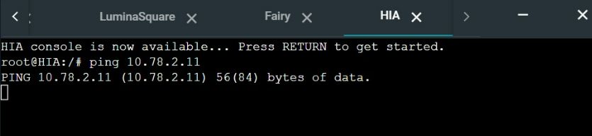

# Jarkom-Modul-5-IT29-2024

## Anggota Kelompok
| Nama | NRP |
|---------|---------|
| Harwinda | 5027231079   |
| Muhammad Syahmi Ash Shidqi | 5027231085 |

## Topologi


## Subnetting


## Konfigurasi Network
### NewEridu
```
auto eth0
iface eth0 inet dhcp

#A1
auto eth1
iface eth1 inet static
  address 10.78.0.1
  netmask 255.255.255.252
  
#A2
auto eth2
iface eth2 inet static
  address 10.78.0.5
  netmask 255.255.255.252
```

### ScootOutpost
```
#A6
auto eth0
iface eth0 inet static
  address 10.78.2.2
  netmask 255.255.255.248
  gateway 10.78.2.1

#A9
auto eth1
iface eth1 inet static
  address 10.78.2.129
  netmask 255.255.255.252
```

### SixStreet
```
#A1
auto eth0
iface eth0 inet static
  address 10.78.0.2
  netmask 255.255.255.252
  gateway 10.78.0.1

#A6
auto eth1
iface eth1 inet static
  address 10.78.2.1
  netmask 255.255.255.248

#A7
auto eth2
iface eth2 inet static
  address 10.78.2.9
  netmask 255.255.255.248
```

### OuterRing
```
#A6
auto eth0
iface eth0 inet static
  address 10.78.2.3
  netmask 255.255.255.248
  gateway 10.78.2.1

#A8
auto eth1
iface eth1 inet static
  address 10.78.2.65
  netmask 255.255.255.192
```

### HDD (DNS)
```
#A7
auto eth0
iface eth0 inet static
  address 10.78.2.10
  netmask 255.255.255.248
  gateway 10.78.2.9
```

### HollowZero
```
#A9
auto eth0
iface eth0 inet static
  address 10.78.2.130
  netmask 255.255.255.252
  gateway 10.78.2.129
```

### Caesar (Client)
```
auto eth0
iface eth0 inet dhcp
```

### Burnice (Client)
```
auto eth0
iface eth0 inet dhcp
```

### Fairy (DHCP)
```
#A7
auto eth0
iface eth0 inet static
  address 10.78.2.11
  netmask 255.255.255.248
  gateway 10.78.2.9
```

### LuminaSquare
```
#A2
auto eth0
iface eth0 inet static
  address 10.78.0.6
  netmask 255.255.255.252
  gateway 10.78.0.5

#A3
auto eth1
iface eth1 inet static
  address 10.78.0.9
  netmask 255.255.255.248

#A5
auto eth2
iface eth2 inet static
  address 10.78.1.1
  netmask 255.255.255.0
```

### BalletTwins
```
#A3
auto eth0
iface eth0 inet static
  address 10.78.0.11
  netmask 255.255.255.248
  gateway 10.78.0.9

#A4
auto eth1
iface eth1 inet static
  address 10.78.0.129
  netmask 255.255.255.128
```

### HIA
```
#A3
auto eth0
iface eth0 inet static
  address 10.78.0.10
  netmask 255.255.255.248
  gateway 10.78.0.9
```

### Lycaon(Client)
```
auto eth0
iface eth0 inet dhcp
```

### Ellen(Client)
```
auto eth0
iface eth0 inet dhcp
```

### Policeboo (Client)
```
auto eth0
iface eth0 inet dhcp
```

### Jane (Client)
```
auto eth0
iface eth0 inet dhcp
```


## Routing
### NewEridu
```
#KIRI
post-up route add -net 10.78.2.8 netmask 255.255.255.248 gw 10.78.0.2 #A7
post-up route add -net 10.78.2.0 netmask 255.255.255.248 gw 10.78.0.2 #A6
post-up route add -net 10.78.2.128 netmask 255.255.255.252 gw 10.78.0.2 #A9

#KANAN
post-up route add -net 10.78.0.8 netmask 255.255.255.248 gw 10.78.0.6 #A3
post-up route add -net 10.78.1.0 netmask 255.255.255.0 gw 10.78.0.6 #A5
post-up route add -net 10.78.0.128 netmask 255.255.255.128 gw 10.78.0.6 #A4
```

### ScootOutpost
```
post-up route add -net 10.78.0.0 netmask 255.255.255.252 gw 10.78.2.1 #A1
```

### SixStreet
```
up echo nameserver 192.168.122.1 > /etc/resolv.conf

post-up route add -net 10.78.2.128 netmask 255.255.255.252 gw 10.78.2.2 #A9

post-up route add -net 10.78.2.64 netmask 255.255.255.192 gw 10.78.2.3 #A8
```

### OuterRing
```
up echo nameserver 192.168.122.1 > /etc/resolv.conf
```

### HDD (DNS)
```
up echo nameserver 192.168.122.1 > /etc/resolv.conf
```

### HollowZero
```
post-up route add -net 10.78.0.0 netmask 255.255.255.252 gw 10.78.2.129 #A1
```

### Fairy (DHCP)
```
up echo nameserver 192.168.122.1 > /etc/resolv.conf

post-up route add -net 10.78.2.64 netmask 255.255.255.192 gw 10.78.2.9 #A8
post-up route add -net 10.78.1.0 netmask 255.255.255.0 gw 10.78.2.9 #A5
post-up route add -net 10.78.0.128 netmask 255.255.255.128 gw 10.78.2.9 #A4
```

### LuminaSquare
```
up echo nameserver 192.168.122.1 > /etc/resolv.conf

post-up route add -net 10.78.0.128 netmask 255.255.255.128 gw 10.78.0.11 #A4
```

### BalletTwins
```
post-up route add -net 10.78.2.8 netmask 255.255.255.248 gw 10.78.0.9 #A7

up echo nameserver 192.168.122.1 > /etc/resolv.conf
```

### HIA
```
post-up route add -net 10.78.0.4 netmask 255.255.255.252 gw 10.78.0.9 #A2
```

### Misi 2 No 2
perangkat lain tidak bisa mengakses fairy, sedangkan fairy bisa mengakses semua perangkat.

lakukan command di Fairy
```
iptables -A INPUT -p icmp --icmp-type echo-request -j DROP
```

### Testing
Fairy ke HIC (bisa ping)


HIC ke Fairy (Tidak bisa ping)



### Misi 2 No 3
Hanya Fairy yang dapat mengakses HDD, dan gunakan nc (netcat) untuk memastikan akses

Jalankan semuanya (dhcpnya), kemudian di HDD command
```
iptables -L INPUT -n --line-numbers
```
*untuk melihat mengecek dan memetakan aturan firewall yang mengatur siapa yang boleh masuk ke sistem*

kemudian, blok semua akses perangkat lain dengan command
```
iptables -P INPUT DROP
```

untuk memberikan izin Fairy mengakses HDD (DNS) lakukan command
```
iptables -A INPUT -s 10.72.2.11 -j ACCEPT
```
untuk Drop semua akses lakukan command
```
iptables -D INPUT 1
```

dari Fairy ke HDD (bisa ping)


dari Lumina ke HDD (tidak bisa ping)


untuk testing dengan netcat, pastikan membuka port yang akan digunakan di HDD
*jangan lupa untuk restart HDD dan install netcat dulu `apt-get update` dan `apt-install netcat`* kemudian lakukan blok kayak diatas dan testing netcat dengan command di HDD:
```
nc -l -p 3030
```


testing pada fairy dengan command
```
echo "pesan" |nc 10.78.2.10 3030
```


lalu balik lagi ke  HDD <br>
**Berhasil*


testing Pada LuminaSquare dengan cara buka port pada HDD disini saya menggunakan port 3030
```
nc -l -p 3030
```


kemudian pada Lumina command:
```
echo "pesan" |nc 10.78.2.10 3030
```


lalu balik lagi ke HDD <br>
**tidak terkirim apa - apa*


